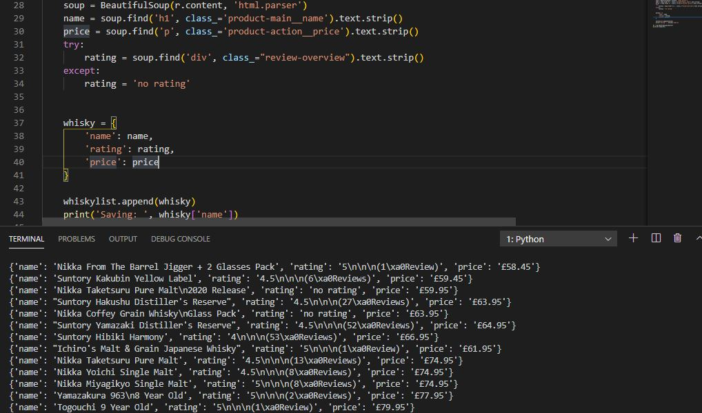

# whiskyscraper

This is a multi page web scraper that pulls html data from thewhiskyexchange.com. Using BeautifulSoup the script goes into each product page and retrieves each title, rating and number of reviews then exports that data to CSV using Pandas.  It was made by following a really helpful YouTube tutorial I found <a href src="https://www.youtube.com/watch?v=nCuPv3tf2Hg">here.</a>

